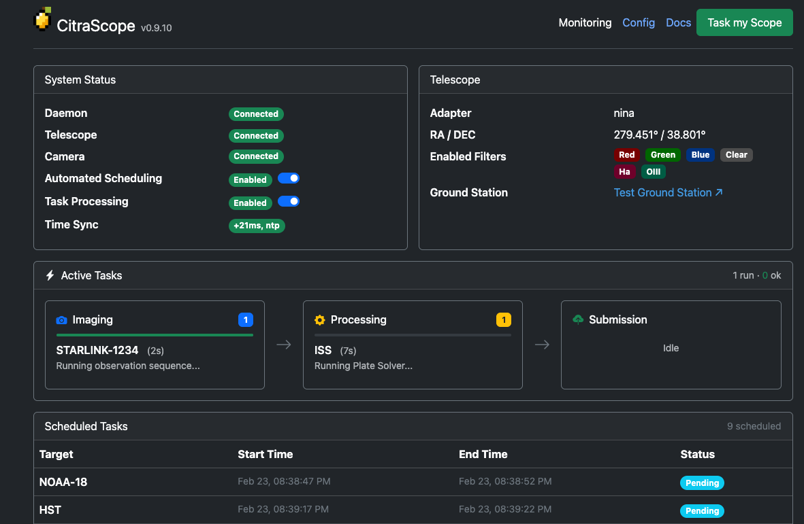

# CitraScope

[](https://github.com/citra-space/citrascope/actions/workflows/pytest.yml) [](https://github.com/citra-space/citrascope/actions/workflows/pypi-publish.yml) [](https://pypi.org/project/citrascope/) [](https://pypi.org/project/citrascope/) [](https://github.com/citra-space/citrascope/blob/main/LICENSE)

**[Documentation](https://docs.citra.space/citrascope/)** | **[Citra.space](https://citra.space)** | **[PyPI](https://pypi.org/project/citrascope/)** | **[CitraScope-Pi](https://github.com/citra-space/citrascope-pi)**

Photograph satellites from your backyard telescope.

CitraScope turns your astrophotography rig into an autonomous satellite observation station. It connects to [Citra.space](https://citra.space), picks up tasks for specific satellites, slews your telescope, captures images, and processes everything on the edge — plate solving, source extraction, photometry, and satellite matching — before delivering calibrated results back to the platform.



Use [Citra.space](https://citra.space) to search for satellites, schedule observation windows, and task your telescope — CitraScope handles the rest. If you already have a mount, a camera, and software like [N.I.N.A.](https://nighttime-imaging.eu/) or [KStars/Ekos](https://kstars.kde.org/), CitraScope plugs right in. Install it, select your hardware adapter, and you're one click away from photographing the ISS.

## Supported Hardware

| Adapter | Platform | Connects to |
|---------|----------|-------------|
| **NINA** | Windows | [N.I.N.A.](https://nighttime-imaging.eu/) via Advanced HTTP API |
| **KStars** | Linux, macOS | [KStars/Ekos](https://kstars.kde.org/) via D-Bus |
| **INDI** | Linux | Any [INDI](https://indilib.org/)-compatible device |
| **Direct** | Any | Composable device adapters (USB cameras, Ximea, Raspberry Pi Camera) |

## Quick Start

**Requires Python 3.10, 3.11, or 3.12.**

```sh
python3 -m venv citrascope-env
source citrascope-env/bin/activate
pip install citrascope
```

Then start the daemon:

```sh
citrascope
```

Open `http://localhost:24872` in your browser to configure your hardware adapter, connect to Citra.space, and start accepting tasks.

**Raspberry Pi?** Check out [citrascope-pi](https://github.com/citra-space/citrascope-pi) for a ready-to-flash SD card image with CitraScope pre-installed.

### Optional Extras

```sh
pip install citrascope[indi]        # INDI protocol support
pip install citrascope[kstars]      # KStars/Ekos via D-Bus
pip install citrascope[usb-camera]  # USB cameras via OpenCV
pip install citrascope[rpi]         # Raspberry Pi Camera Module
pip install citrascope[ximea]       # Ximea industrial cameras
pip install citrascope[all]         # INDI + KStars
```

### CLI Options

```sh
citrascope --help
citrascope --web-port 8080    # Custom web UI port (default: 24872)
```

## Documentation

Full documentation is available at [docs.citra.space/citrascope](https://docs.citra.space/citrascope/). Documentation source is maintained in the [citra-space/docs](https://github.com/citra-space/docs) repository.

## Developer Setup

```sh
python3 -m venv .venv
source .venv/bin/activate
pip install -e '.[dev]'
pre-commit install
```

### Dev Container (INDI on macOS/Windows)

If you need to work with the INDI adapter on a non-Linux host, the project includes a [VS Code Dev Container](https://code.visualstudio.com/docs/devcontainers/containers) that provides a Linux environment with `pyindi-client` and its system dependencies pre-installed. Open the project in VS Code and choose **Reopen in Container**.

### Running Tests

```sh
pytest                          # Unit tests (fast, skips slow tests)
pytest -m "not integration"     # Same as above, explicit
pytest --override-ini="addopts=" -m "not integration"  # Include slow tests locally
```

Tests use `pytest` markers to separate fast unit tests from expensive ones:

| Marker | What it covers | Runs locally | Runs in CI |
|--------|---------------|:------------:|:----------:|
| *(none)* | Unit tests | Yes | Yes |
| `@pytest.mark.slow` | Real FITS processing, plate solving | No | Yes |
| `@pytest.mark.integration` | Live hardware or services | No | Opt-in |

### Pre-commit Hooks

The project uses [pre-commit](https://pre-commit.com/) with **Ruff** (linting + import sorting), **Black** (formatting), and **Pyright** (type checking).

```sh
pre-commit run --all-files    # Run all checks manually
```

### VS Code Launch Configs

The `.vscode/launch.json` includes pre-configured debug configurations:
- **Python: citrascope** — Runs the daemon with default settings
- **Python: citrascope (custom port)** — Runs with web interface on port 8080

### Releasing

```sh
bump-my-version bump patch    # 0.1.3 → 0.1.4
bump-my-version bump minor    # 0.1.3 → 0.2.0
bump-my-version bump major    # 0.1.3 → 1.0.0
git push && git push --tags
```

Tagging triggers `create-release.yml` which creates a GitHub release, which in turn triggers `pypi-publish.yml`.

## License

[MIT](LICENSE)
